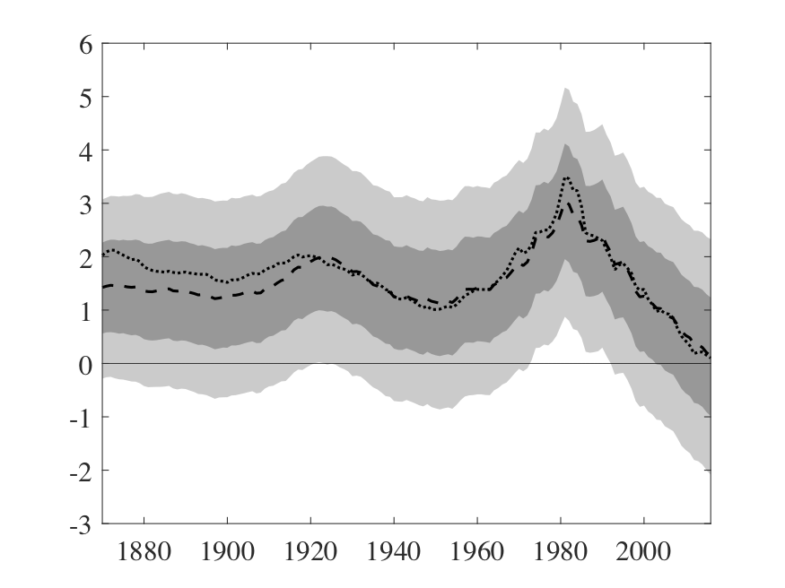

# rstarGlobal

Replication files for *[Global Trends in Interest Rates](https://doi.org/10.1016/j.jinteco.2019.01.010)* by Marco Del Negro, Domenico Giannone, Marc Giannoni, and Andrea Tambalotti.

## Updated r* estimates
The [Excel file](update/Rstar_Vintages.xlsx) contains original and updated estimates (forthcoming) of the U.S. and world real interest rates. These are the estimates displayed in figure 1 of the paper. The below figure shows the latest values.

*Fig.1. Trends in Global and U.S. Real Rates: 1870-2016, Baseline Model. Note: The figure plots the posterior median of the trend in the world real interest rate (dashed line) together with its 68 and 95 percent posterior coverage intervals, as well as the posterior median of the trend in the U.S. real rate (dotted line).*

## Required software

These scripts were produced using MATLAB R2017b.

## Installing this repository

Git users are welcome to fork this repository or clone it for local use. Non-Git users will probably find it easiest to download the zip file by clicking on the green `Clone or download` button on the right hand side of this screen, and then clicking "Download ZIP."

## Directory structure
- `figures/`: Figures from the paper's main body.
- `indata/`: Input data.
	- `Data_MY.xlsx`: Middle-aged and young individuals dataset.
	- `DataInflShortLongUpdated.xlsx`: Dataset for baseline model (inflation, short-term rate, long-term rate).
- `results/`: Model results in '.mat' format.
	- `OutputModelX.mat`: See "scripts/" for the naming convention.
- `scripts/`: Scripts for estimation and producing figures
	- `MainModelX_MakeFigures.m`: The "MakeFigures" suffix makes figures for the respective model.
	- `MainModelvar01.mat`: Estimates the baseline model with prior to variance of innovation to the trend component equal to 1.
	- `MainModel1.mat`: Estimates the baseline model.
	- `MainModel1_ReR`: Estimates baseline model under the real exchange rate specification.
	- `MainModel1_unrestr`: Estimates baseline model with unrestricted loading on real rate.
	- `MainModel1_1950.m`: Estimates baseline model starting in 1950.
	- `MainModel1_df50.m`: Estimates baseline model with 50 degrees of freedom.
	- `MainModel1_varX.m`: Estimates baseline model with variance of innovation to trend equal to 1/X.
	- `MainModel2.m`: Estimates convenience yield model.
	- `MainModel3.m`: Estimates consumption model.
- `update/`: Updated versions of figure 1 along with its underlying data.

## How to run the code

Each model is generated using a script titled `MainModelX.m`. Scripts with an underscored suffix (e.g. `MainModel1_1950.m`) correspond to minor modifications to the baseline model; see the appendix for details. 

`estimateAll.m` is the main script for running all the estimation routines. Set `estimateAppendices = 1` to run all specifications. MCMC results are stored as `.mat` files in the `results` folder. Depending on the machine, running the main body specifications for 100,000 draws takes around 20 hours. Reduce the number of draws for faster results.

Paper figures are created using the files with the `_MakeFigures.m` suffix. 

## Data sources

The [`indata`](indata/) folder contains the underlying data. Data on short-term rates, long-term rates, and consumer prices come from the Jordà-Schularick-Taylor Macrohistory Database. Data for Moody's Baa corporate bond yield are available from FRED. Demographic data come from the United States Census Bureau and from the UN World Population Statistics database. Data on corporate spreads come from Gilchrist and Mojon (2018). Please see the paper for additional details on the data sources.

## Disclaimer
Copyright Federal Reserve Bank of New York. You may reproduce, use, modify, make derivative works of, and distribute and this code in whole or in part so long as you keep this notice in the documentation associated with any distributed works. Neither the name of the Federal Reserve Bank of New York (FRBNY) nor the names of any of the authors may be used to endorse or promote works derived from this code without prior written permission. Portions of the code attributed to third parties are subject to applicable third party licenses and rights. By your use of this code you accept this license and any applicable third party license.

THIS CODE IS PROVIDED ON AN "AS IS" BASIS, WITHOUT ANY WARRANTIES OR CONDITIONS OF ANY KIND, EITHER EXPRESS OR IMPLIED, INCLUDING WITHOUT LIMITATION ANY WARRANTIES OR CONDITIONS OF TITLE, NON-INFRINGEMENT, MERCHANTABILITY OR FITNESS FOR A PARTICULAR PURPOSE, EXCEPT TO THE EXTENT THAT THESE DISCLAIMERS ARE HELD TO BE LEGALLY INVALID. FRBNY IS NOT, UNDER ANY CIRCUMSTANCES, LIABLE TO YOU FOR DAMAGES OF ANY KIND ARISING OUT OF OR IN CONNECTION WITH USE OF OR INABILITY TO USE THE CODE, INCLUDING, BUT NOT LIMITED TO DIRECT, INDIRECT, INCIDENTAL, CONSEQUENTIAL, PUNITIVE, SPECIAL OR EXEMPLARY DAMAGES, WHETHER BASED ON BREACH OF CONTRACT, BREACH OF WARRANTY, TORT OR OTHER LEGAL OR EQUITABLE THEORY, EVEN IF FRBNY HAS BEEN ADVISED OF THE POSSIBILITY OF SUCH DAMAGES OR LOSS AND REGARDLESS OF WHETHER SUCH DAMAGES OR LOSS IS FORESEEABLE.
